# Report for Assignment 1

## freecodecamp-java-algortithms

Name: freecodecamp-java-algortithms

original project:
[Project URL](https://github.com/MaheshB77/freecodecamp-java-algorithms)

our repository:
[Project URL](https://github.com/ivns1/freecodecamp-java-algorithms-forSEP)

Number of lines of code and the tool used to count it: 
The tool used to count the number of lines of code is cloc (Count Lines of Code) in the WSL terminal, which yields the following result:

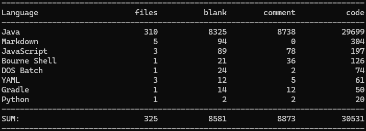

So, because the chosen programming language is Java, the number of lines of code in the programming language chosen by the group is 29699. Which is ~29.7 KLOC

Programming language: Java

## Coverage measurement

### Existing tool

The existing coverage tool used is the coverage tool native to IntelliJ. It is used by right clicking the filter containing the tests, which in this case is located in the folder test/java/com.williamfiset.algorithms. And then clicking More/Run/Debug -> Run ‘Tests in com.williamfiset.algorithms’ with Coverage:

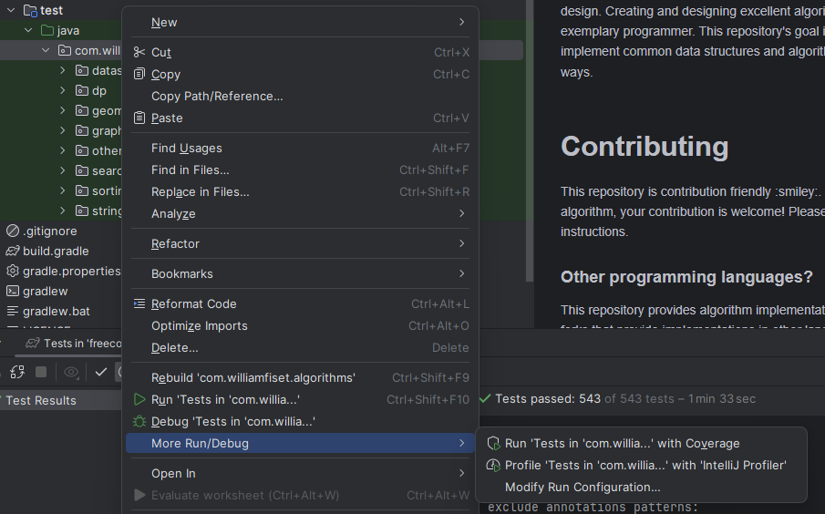

And the coverage breakdown:

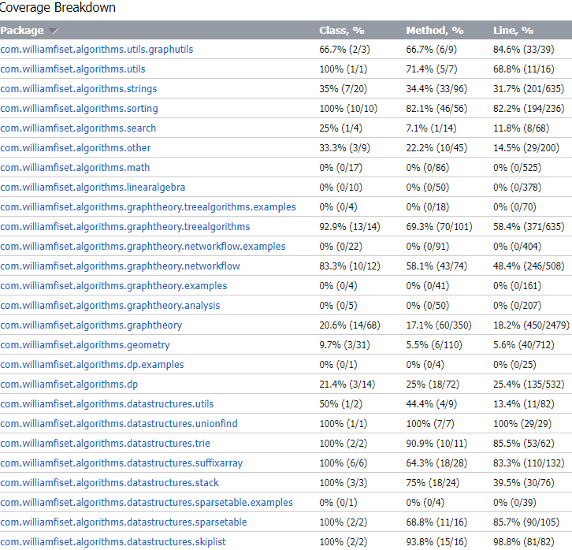
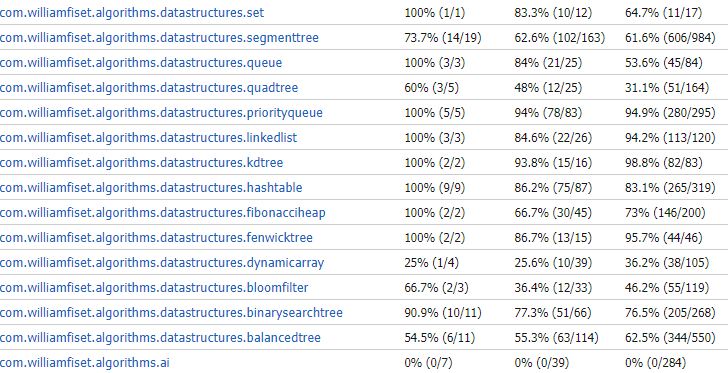

### Your own coverage tool

Isaac

isPrime(n)

[URL for commit of coverage](https://github.com/ivns1/freecodecamp-java-algorithms-forSEP/commit/509245207b9a7f1f97060892e090c274816a878e)

This commit contains changes that include a class used for branch coverage called “BranchCoverageIsaac” and changes in the file “isPrime.Java” that implements the coverage report. Although the original fork did not contain a test file for this function, the coverage results can only be obtained by using the test file I created myself.

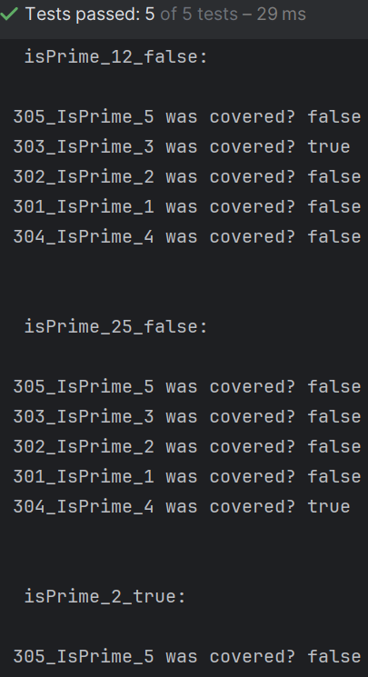

modInv(a, m)

[URL for commit](https://github.com/ivns1/freecodecamp-java-algorithms-forSEP/commit/7dab4ba8596b6b777867de5d772c26e5523eb864)

This commit contains changes necessary to correctly implement the branch coverage for the function modInv.
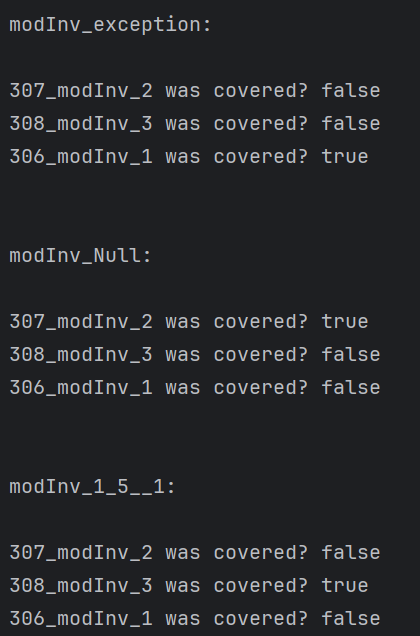

Miguel

Since i choose 2 functions inside the same class, i have made in comments which IDs belong to which function:

insert(Node node, T value)

[URL for commit of coverage](https://github.com/MaheshB77/freecodecamp-java-algorithms/commit/c5554b6c28fd1cac9febdcdeac1dcdb74a550633)
(IMAGE HERE)
So all branches from 401 to 406 are covered by the new test InsertTest(). Passing the function from 0% coverage to 100% coverage. 

balance(Node node)

[URL for commit of coverage](https://github.com/MaheshB77/freecodecamp-java-algorithms/commit/c5554b6c28fd1cac9febdcdeac1dcdb74a550633)
(IMAGE HERE)
So all branches from 407 to 412 are covered by the new tests. We can see that we also have some coverage on the insert(Node node, T value) function since all tests involve firstly inserting numbers on the Tree.

Mitra 

tenarySearch

[URL for commit of coverage](https://github.com/ivns1/freecodecamp-java-algorithms-forSEP/commit/1fba2e149eb55d961d954022017220ab6f7a6b35)
(IMAGE HERE)
The function has three branches and the coverage tool shows that all of them are hit by the test that has been made. 

ternarySearchDiscrete

[URL for commit of coverage](https://github.com/ivns1/freecodecamp-java-algorithms-forSEP/commit/ec5f1179ed24b773a27e8c0582167bf27580e14d#diff-ab8d40c0b875f4c28dc7127eb1b0c0f0f04b20e5ddca656d70a1dbca98248970)
(IMAGE HERE)
The coverage tool file that I have made implements both functions. In this commit the file has been extended in order to print the coverage for the ternarySearchDiscrete file. 
For this function, I have implemented the coverage tool in the same test file as the first function. However, this time, I integrated the coverage tool before finalizing the test file. Therefore, the coverage output indicates that none of the branches have been hit yet, meaning the coverage is currently at 0 percent.

Safia

MaximumSubarrayValue(int[ ] ar)

[URL for commit of coverage](https://github.com/ivns1/freecodecamp-java-algorithms-forSEP/commit/2a376d9095dc6b3575061f9fa31f7cce825ab670)
(IMAGE HERE)
To enhance the functionality of this function, the BranchCoverageMaximumSubarray class was integrated into the MaximumSubarray class. This integration was specifically designed to support branch coverage testing, ensuring a comprehensive evaluation of the algorithm's execution paths. Subsequently, the updated function was rigorously tested using a custom test file named MaximumSubarrayTest, which validates the function’s correctness and coverage.

function: lis(int[ ] ar)

[URL for the commit of coverage](https://github.com/ivns1/freecodecamp-java-algorithms-forSEP/commit/e18a6a732b2594cc6bbbf63f7079d2868658912e)
(IMAGE HERE)
To enhance the functionality of this function, the BranchCoverageLIS class was integrated into the LongestIncreasingSubsequence class. This integration was specifically designed to support branch coverage testing, ensuring a comprehensive evaluation of the algorithm's execution paths. Subsequently, the updated function was rigorously tested using a custom test file named LongestIncreasingSubsequenceTest, which validates the function’s correctness and coverage.

## Coverage improvement

### Individual tests

Isaac

isPrimeTest

[URL for commit of tests](https://github.com/ivns1/freecodecamp-java-algorithms-forSEP/commit/ba778da7c881cb5c4f37f9d9b0f801718f89f2bf)

Old coverage results:

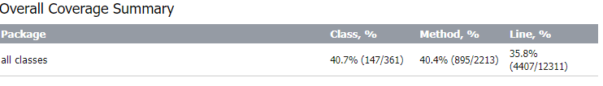

New coverage results:

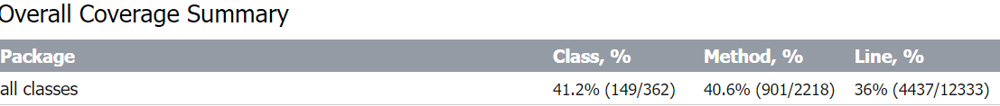
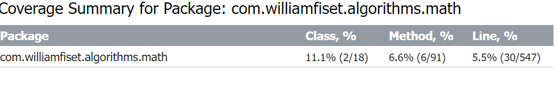
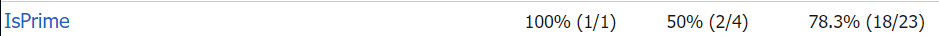

The coverage improvement is 0.5% in class coverage, 0.2& in method coverage and 0.2% in line coverage. But thhe increase in coverage for the math package is more significant.
This happened firstly because the coverage improvement Class, Method and Line all increased after implementing tests for “ïsPrime” because prior to implementation there were no tests for this function. As we can see in the screenshots,

Old coverage result:

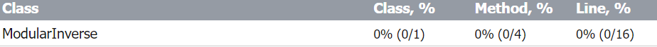

New coverage results:

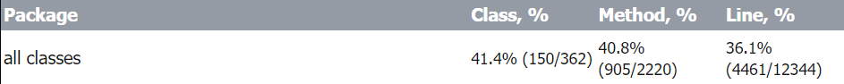

<Provide the same kind of information provided for Test 1>

Miguel 

Since both functions I chose are in the same class, I decided to commit both functions together and use the same screenshot for both. This is because it would be difficult to show the improvement in one function without including the other, as both functions are interdependent.

insertTest() and (testBalanceLeftLeftCase(), testBalanceLeftRightCase(), testBalanceRightLeftCase(), testBalanceRightRightCase())

[URL for commit of test](https://github.com/ivns1/freecodecamp-java-algorithms-forSEP/commit/8d8e16e21fb3d230eaba652ce4b39c1d02e60bc0)
(IMAGE HERE)
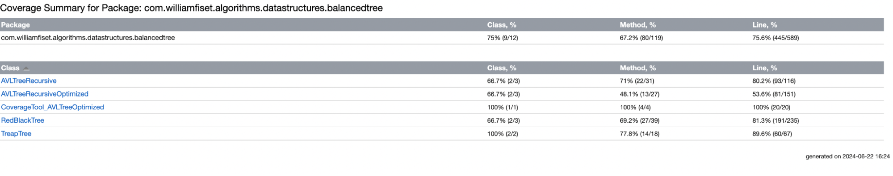
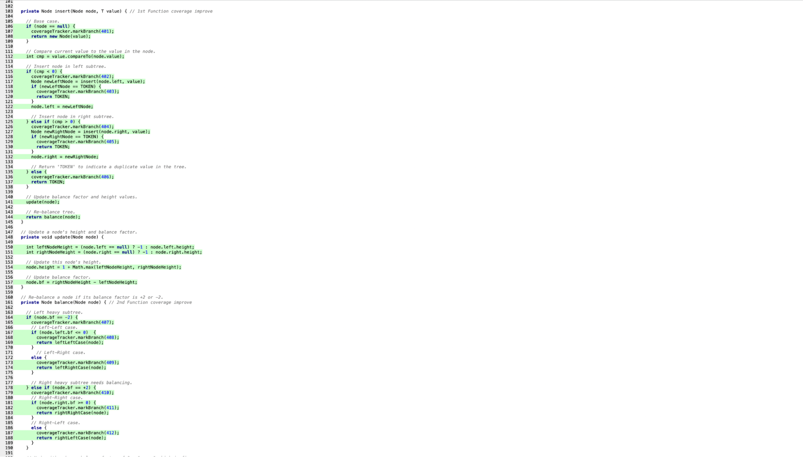

Coverage has improved since there were previously no tests for the AVLTreeRecursiveOptimized. With the implementation of five tests - one specifically for the insert(Node node, T value) function and four for the balance(Node node) function - we now observe that both methods achieve 100% coverage. Additionally, overall coverage of the AVLTreeRecursiveOptimized has increased, with 13 out of 27 methods now being tested. The coverage for the two functions specifically went from 0% to 100%. 

Mitra 

TernarySearchTest

[URL for commit of tests](https://github.com/ivns1/freecodecamp-java-algorithms-forSEP/commit/1fba2e149eb55d961d954022017220ab6f7a6b35)

(IMAGE HERE)

Initially, none of the three methods were covered. Now, one out of three methods is covered, increasing the overall method coverage to 33.3%. Additionally, the covered method has 100% branch coverage.

ternarySearchDiscrete

[URL for commit of tests](https://github.com/ivns1/freecodecamp-java-algorithms-forSEP/commit/b2fbc3613fff016ffd39e52f827b6559ac32b07a)

(IMAGE HERE)
(IMAGE HERE)

Initially, none of the five methods were covered. Now, three out of five methods are covered, raising the overall method coverage to 60%. Additionally, the covered methods have 85.7% branch coverage, as the test hits 6 out of 7 branches.

Safia

MaxSubarrayTest

[URL for commit of tests](https://github.com/ivns1/freecodecamp-java-algorithms-forSEP/commit/7fcf1a49a551f687a05d4277b644b25671f59f66)

This testing for the maxSubarrayValue function was developed from scratch as there was no such in the original codebase. The goal was to validate the function's correctness and performance across the different input scenarios. By creating specific test cases—from single-element arrays to complex mixed-value arrays—the tests aimed to ensure that the maxSubarray function operates reliably and efficiently. 

The coverage for the function MaxSubarray has improved from 0% to 100%, as it had initially not been tested at all. After thorough testing, we achieved complete coverage for this function. While the main method was also covered, my primary focus was ensuring comprehensive testing of the MaxSubarray function, as it can be seen in the image below.

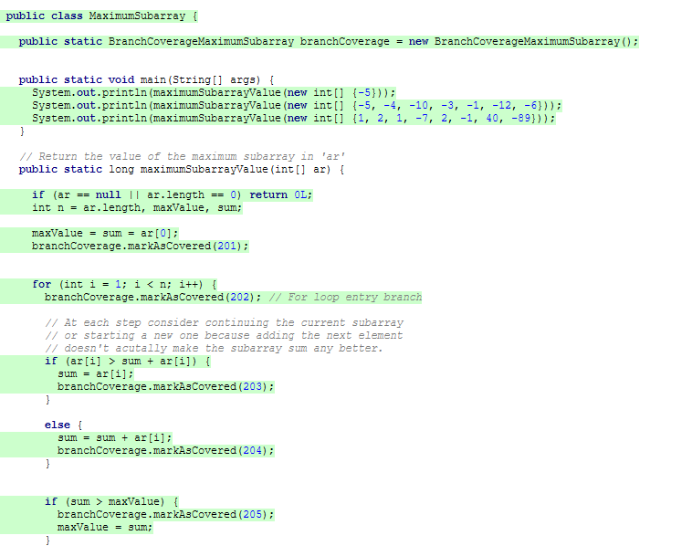

LongestIncreasingSubsequenceTest

[URL for commit of tests](https://github.com/ivns1/freecodecamp-java-algorithms-forSEP/commit/5292976d4a48667be359ed0b99a21b316060bb6c)
old:

new:
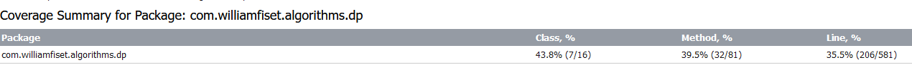

This testing for the LongestIncreasingSubsequence function was developed from scratch as there was no such in the original codebase. The goal was to validate the function's correctness and performance across the different input scenarios. By creating specific test cases—from empty arrays to complex mixed-value arrays—the tests aimed to ensure that the LongestIncreasingSubsequence function operates reliably and efficiently. 

The coverage for the function lis has improved from 0% to 100%, as it had initially not been tested at all. After thorough testing, we achieved complete coverage for this function,as it can be seen in the image below.

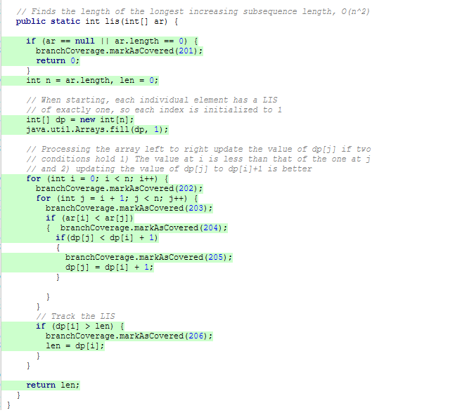

### Overall

Before modifications:

After modifications:
<Provide a screenshot of the new coverage results by running the existing tool using all test modifications made by the group>

## Statement of individual contributions

Isaac: I contributed by creating tests and implementing a branch coverage tool for the functions isPrime() and modInv(). I also contributed to the project by doing the following: line count, doc setup, contributed to finding project, coverage before improvements, contributed to the readme

Miguel: contributed to finding project, create a coverage tool, create tests for 2 functions, reviewing the coverage, cleaning up the report, merging all branches, update of README file

Mitra: contributed to find the project

Safia: contributed to find the project
